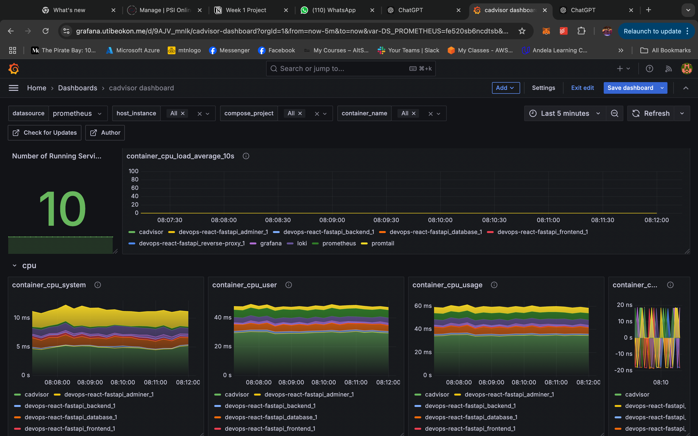

# Automating Full-Stack App Deployments: Application and Monitoring Setup Using Docker Compose.

---

This project orchestrates a robust full-stack deployment featuring a FastAPI backend, React frontend, PostgreSQL database, and a comprehensive monitoring stack. From Dockerization to reverse proxy routing, this project ensures seamless deployment and insightful monitoring, making it a symphony of interconnected services tailored for high performance and scalability.



## Overview
__This project demonstrates:__
- Dockerizing and orchestrating a full-stack application.
- Configuring advanced monitoring and logging tools.
- Setting up a reverse proxy for efficient routing.
- Deploying the stack to a cloud platform with a custom domain and HTTPS.

__Highlights:__
🚀 Tech Stack: React, FastAPI, PostgreSQL, Docker, Prometheus, Grafana, Loki, cAdvisor.
🔍 Monitoring Tools: Real-time metrics, logs,container insights, customized dashboards.
🌐 Cloud Deployment: Accessible using cloud service via a secure domain.

## Before You Begin
__You should have:__
- Docker and Docker Compose installed
- An instance from a cloud provider (Azure, AWS, or GCP)
- The following ports accessible, 80, 443, 8080 and 22 (if you intend to make access the server) 
- Domain name
- Basic knowledge of Docker

## Core Components
__Application stack Services:__
- React Frontend: A dynamic and responsive UI powered by Chakra UI
- FastAPI Backend: Provides REST APIs and Swagger documentation and using Poetry as package manager.
- PostgreSQL: A robust database for persistent storage.
- Traefik: Reverse Proxy fpr routing traffic seamlessly to appropriate services.

__Monitoring stack services:__
- Prometheus: Collects and stores real-time metrics and provides querying abilities
- Grafana: Visualizes performance and logs using data from prometheus and Loki
- Loki & Promtail: Promtail collects logs, and Loki stores them for querying and visualization.
- cAdvisor: Monitors container resource usage and forwards metrics to promethues

## Setting Up
__1. Clone the Repository__
```bash
git clone https://github.com/yutee/devops-react-fastapi.git  
cd devops-react-fastapi
```

__2. Create Environment Variables__
Prepare .env files for the frontend, backend and docker compose configurations, you can find each env file in their respective directory:

For the application stack:
```bash
#domain
DOMAIN=yourdomain.com

# database
POSTGRES_USER=youruser  
POSTGRES_PASSWORD=yourpassword  
POSTGRES_DB=yourdb  
BACKEND_PORT=5000  
FRONTEND_PORT=80 

# cors
BACKEND_CORS_ORIGINS="http://yourdomain.com,https://yourdomain.com"
```

Ensure URL is properly updated:
```bash
VITE_API_URL=yourdomain.com
```

Docker-compose env:
```bash
DOMAIN=yourdomain.com
```

__3. Inspect Configurations__
If you want to explore the codebase and/or add custom configuration, .

3. Application Stack Compose
Files: [docker-compose.yml](docker-compose.yml) | [traefik.yml](./traefik.yml) | 

4. Monitoring Stack Compose
File: [/monitoring/docker-compose.yml](/monitoring/docker-compose.yml) |

You can also find a link to an article covering the full process from start to finish and a little bit more from a learning perspective [here](https://dev.to/yutee_okon/from-chaos-to-clarity-deploying-react-and-fastapi-app-with-monitoring-1m6g-temp-slug-3047830?preview=a96ae8f62a1f54be27522937b33e7457f7d3ca2f5930c8135404e6e843f99c7c6643cebb9010f9b1531cad06378b43802cb6aa1a7743f172208c18a9).

__4. Bring Up the Stacks__
SSH into your cloud instance, Ensure you are in the root directory and then run:
```bash
# create file for tls certificate, traefik and let's encrypt nneds this
touch acme.json
chmod 600 acme.json

# spin up both stacks. use "--build" if you do not already have the images
docker compose up -d --build
```
This will provision the complete application including the monitoring stack.

__N/B:__ If you do not want to perform the deployment manually, you can use a customizable Actions workflow available at `.github/workflow.deploy.yaml`.

__5. Domain, Accessibility & Monitoring__
- Set up your DNS on your provider account to point to the cloud instance’s public IP address using A records.
- Confirm domain name is properly mapped to your IP address

The application can be accessed at: 
- Frontend: https://yourdomain.com
- Backend API: https://yourdomain.com/api
- Adminer dashboard: https://db.yourdomain.com
- Traefik dashboard: https://traefik.yourdomain.com
- Prometheus: https://yourdomain.com/prometheus
- Granfana: https://yourdomain.com/grafana

For monitoring:
Access Grafana and add prometheus and loki as data source. You can explore the available logs via "Explore". But to ultimately setup a dashboard, Go to Dashboard and create new.

Useful PromQL queries:
```bash
count(container_last_seen{container_label_com_docker_compose_service=~".+"})

{service_name="varlogs"} |~ "ERROR"

{service_name="varlogs"} |= "INFO"

{job="docker"} |= "container"
```

You can also use the follwoing dashboard templates.
Cadvisor metrics dashboard: 19792
Loki + Prometheus dashboard: 13186
